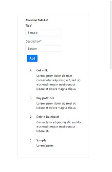

# TinkerWeek.py
Projects using Django done as a part of TinkerWeek.py learning camp.

The models for this projects are as shown:





## Quick Start

To get this project up and running locally on your computer:
1. Set up the Python and Django development environments.
   We recommend using a Python virtual environment.
1. Assuming you have Python and Django setup,run the following commands (if you're on Windows you may use `py` or `py -3` instead of `python3` to start Python):
   ```
   python3 manage.py makemigrations
   python3 manage.py migrate
   python3 manage.py collectstatic
   python3 manage.py test # Run the standard tests. These should all pass.
   python3 manage.py createsuperuser # Create a superuser
   python3 manage.py runserver
   ```
1. Open a browser to `http://127.0.0.1:8000/admin/` to open the admin site
1. Create a few test objects of each type.
1. Open tab to `http://127.0.0.1:8000` to see the main site, with your new objects.
